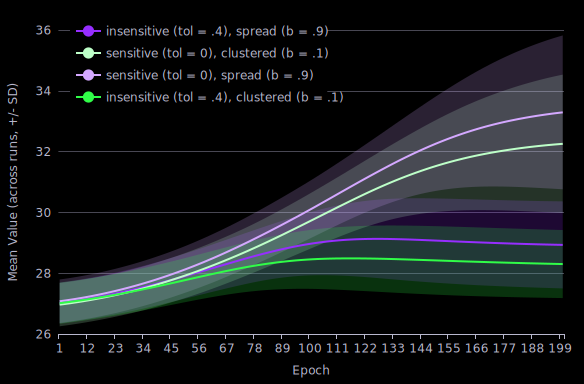
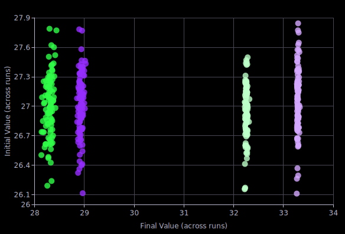

Demo of a live-running agent-based model based on [Hammond & Ornstein, 2014](https://www.ncbi.nlm.nih.gov/pmc/articles/PMC4133329/).

# Implementation

The model is primarily implemented in the [lib/agent.ts](lib/agent.ts) file. The `rollValue` function determines the initial distribution of values, and the `rollConnections` function determines the social environment. The `step` function determines how agents gather information and adjust their values.

The [lib/population.ts](lib/population.ts) file runs the model by generating agents with specified parameters, then executing their `step` functions in a random order with its own `step` function.

## Execution

Models are run from two types of web workers. The primary worker ([app/workers/liveWorker.ts](app/workers/liveWorker.ts)) runs the live-running model. This executes population steps every 100 milliseconds, and sends the updated population to the app every 5 epochs. The batch worker ([app/workers/batchWorker.ts](app/workers/batchWorker.ts)) is spawned for each model variant from the batch runner. These run the variant without timing, collect population averages after each epoch, and send back these and the initial and final population values for each run.

# Analysis

The batch mechanism can be used to better see the effects of different parameters. For instance, this batch looks at the effects of agent tolerance (value sensitivity) and graph beta (rewire probability):

This includes 4 model variants with different parameter combinations: **sensitive** means `agent tolerance = 0` whereas **insensitive** means `agent tolerance = .4`, and **clustered** means `graph beta = .1` whereas **spread** means `graph beta = .9`.

From this, it seems that higher agent sensitivity (`tolerance = 0`; the lighter lines) leads to higher average population values, and higher clustering (`graph beta = .1`; the green lines) leads to slightly more variation in final population values between runs.

A notable property of this model is that values converge across the population to within agent tolerance, which means the original variation (and so, distribution) of the values is lost. If the value is representing an observed feature with the initial distribution, this is probably unrealistic. The agents' `error proportion` parameter adds one way to preserve some variation by adding a random value to each agent's value with each step. This could be thought of as representing all other sources of variation outside of movement toward a norm, though that movement still normalizes the distribution.
